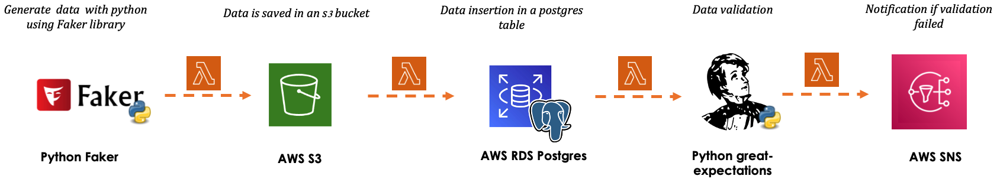

# randomzy

Randomzy is an data pipeline based on AWS infrastucture for data ingestion. A set of random data is generated by python library _Faker_. A lambda function is called to perform ingestion of the data to an S3 bucket. Another lambda function is then triggered to insert the data in a postgres dataset. And finally, we ran some simple _great-expectations_ functions to validate the data based on few conditions.

The following picture shows the complete schema of the architecture:

I had to stop the project for some time because I was experiencing some problems with my AWS account. That was at that moment when I discovered a new way of working with AWS without having an AWS account. The service named [**LocalStack**](https://docs.localstack.cloud/overview/) provides docker containers upon spin up to interact with many of the most uses AWS services for free.

I then decided to add a wrapper around the pipeline above to consider LocalStack.

--Add new pipeline image

## Resources
[1] : https://docs.localstack.cloud/integrations/serverless-framework/

&copy; *Beno-Charles DOKODJO, Technology | Serverless | Cloud*